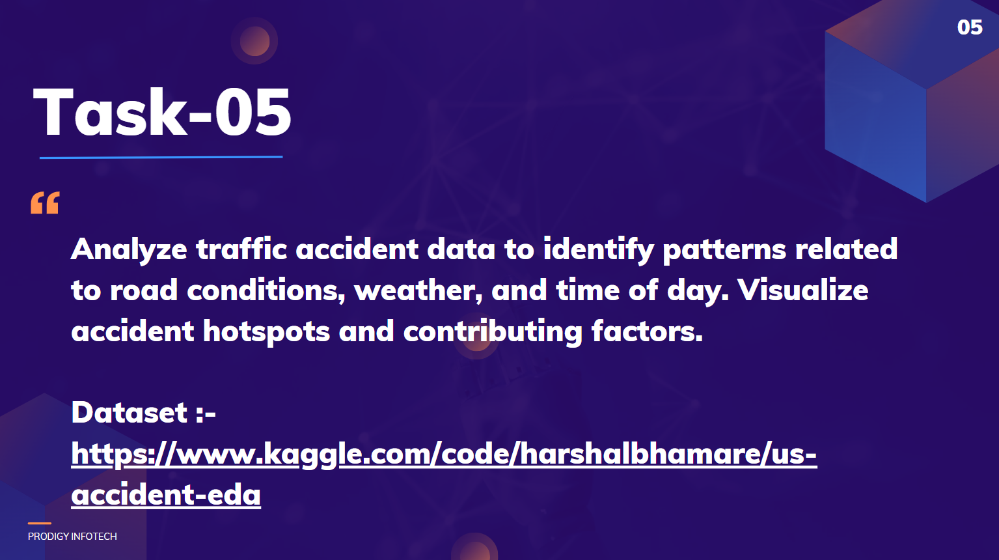

# PRODIGY_DS_05

  
Welcome to my submission for Task 5 of the data science internship at Prodigy Infotech. In this task, I analyzed traffic accident data to identify patterns related to weather, time of the day, and other factors using the US Accident Dataset.  

## Introduction
Traffic accidents are a major concern worldwide, and understanding the factors contributing to these accidents can help in developing strategies to reduce their occurrence. This project aims to analyze traffic accident data to identify patterns related to weather conditions, time of day, and other relevant factors.  

## Dataset
The dataset used for this project is the US Accident Dataset, which contains detailed information about traffic accidents across the United States. The dataset can be found in Kaggle.  

## Tools and Libraries
For this project, I used the following tools and libraries:  

-**Python**: For data manipulation and analysis.  
-**Pandas**: For data cleaning and preprocessing.  
-**NumPy**: For numerical operations.  
-**Matplotlib and Seaborn**: For data visualization.  
-**Jupyter Notebook**: For documenting the analysis and visualizations.  

## Contact
For any queries or further discussion, feel free to reach out to me via LinkedIn or email.  

**LinkedIn**: https://www.linkedin.com/in/kaushik-das-303126236/  
**Email**: dask72544@gmail.com  
